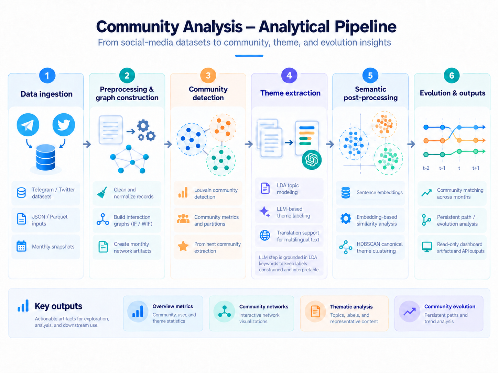
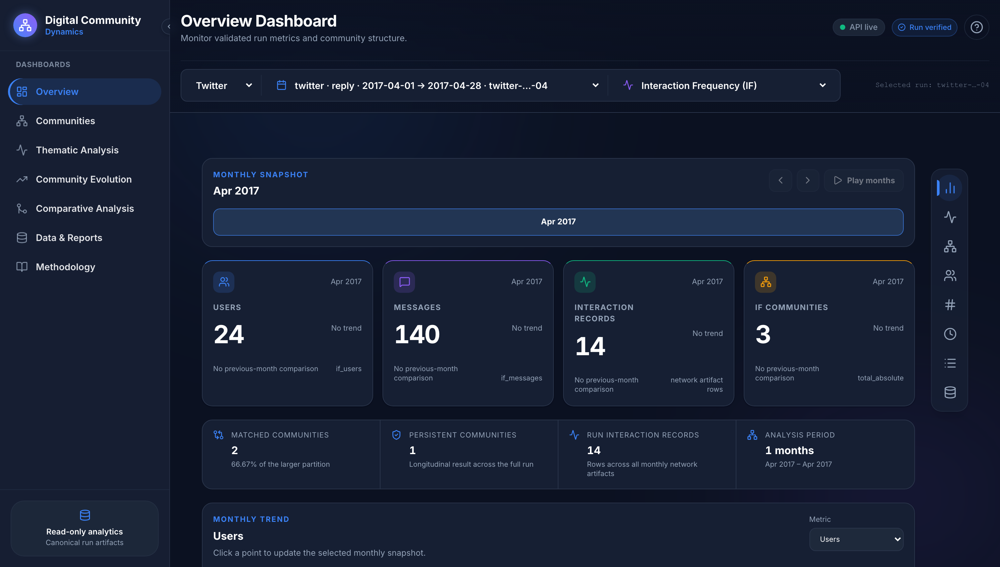
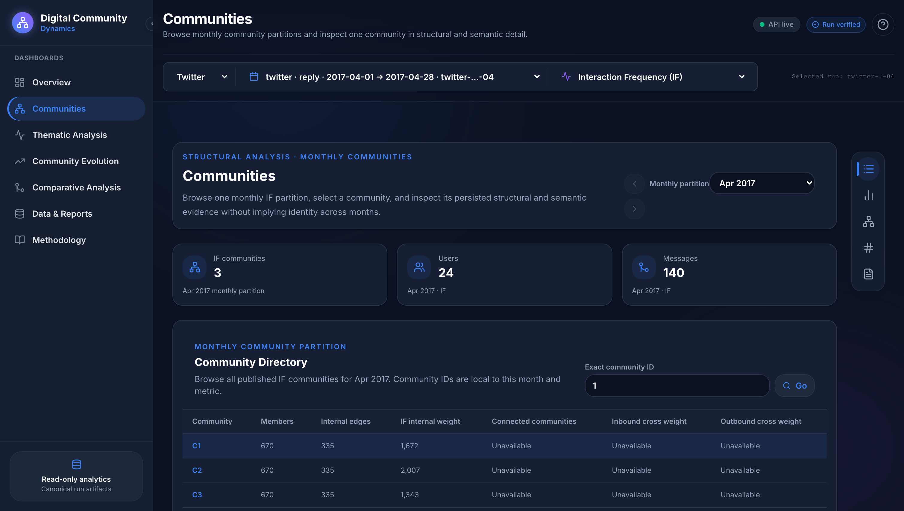
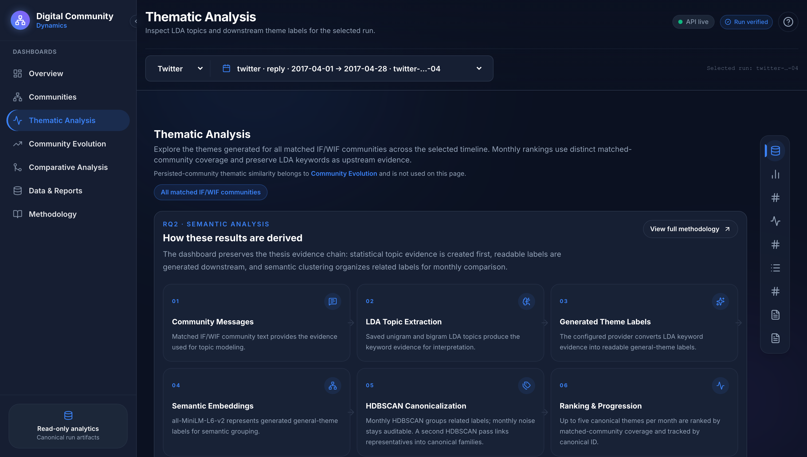
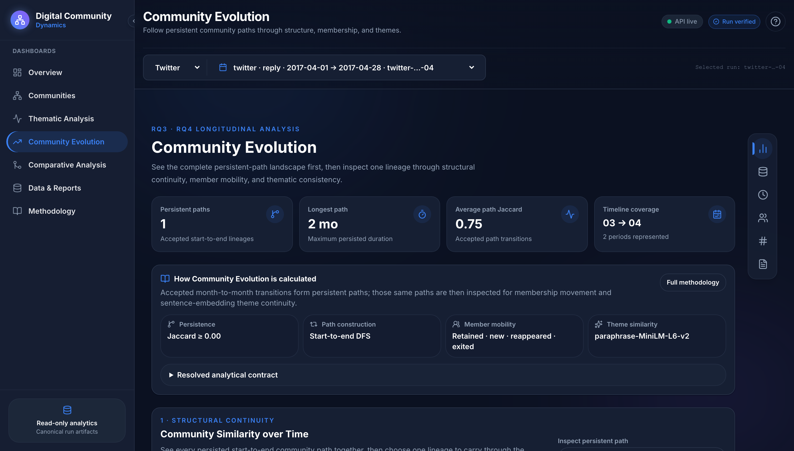
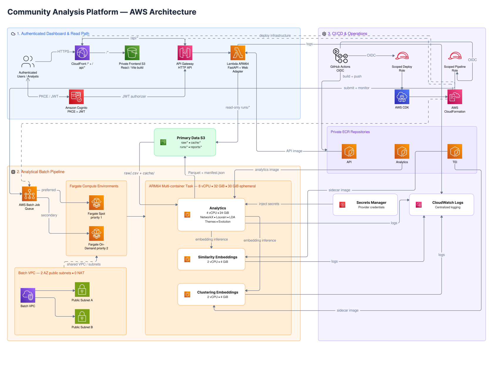

# Community Analysis

**Community Analysis** is an end-to-end machine learning and network-science platform for understanding **how online communities form, what they discuss, and how they evolve over time** across Telegram and Twitter/X.

The platform combines graph analytics, topic modeling, LLM-assisted theme interpretation, sentence embeddings, semantic clustering, and longitudinal analysis. It runs as a reproducible AWS pipeline with immutable analytical artifacts, a read-only FastAPI API, and a React dashboard.


---

## Analysis pipeline

The pipeline combines three views of online communities:

- **Structure:** who interacts with whom, and which communities emerge?
- **Semantics:** what topics and themes characterize those communities?
- **Evolution:** which communities, members, and themes persist or change over time?

The pipeline transforms raw social-platform interactions into structural, thematic, and longitudinal community analysis.

<p align="center">
  
</p>


### Core methods

- **Interaction networks:** user affinities define weighted social graphs from platform interactions.
- **Community detection:** Louvain identifies densely connected communities in each network snapshot.
- **Topic and theme analysis:** LDA extracts topic evidence, followed by LLM-assisted theme interpretation.
- **Semantic analysis:** sentence embeddings and HDBSCAN support theme similarity and clustering.
- **Community evolution:** Jaccard similarity tracks membership continuity, while cosine similarity measures thematic change over time.
---

## Project demo

The dashboard presents the analytical outputs across four views: overview, network structure, thematic analysis, and community evolution.

| Overview | Network / Communities |
|---|---|
|  |  |
| High-level run, network, and community summary. | Community topology, interaction structure, and centrality context. |

| Themes | Community Evolution |
|---|---|
|  |  |
| LDA evidence, generated themes, and semantic clustering. | Persistent paths, transitions, member churn, and thematic continuity. |


## System architecture

The architecture separates long-running analytical workloads from the interactive read path. Graph and NLP jobs run asynchronously, publish immutable artifacts, and are served through a lightweight API and dashboard.



### Design principles

- **Batch compute, lightweight serving:** Louvain, LDA, translation, theme generation, and embeddings run outside API requests.
- **Artifact-based boundary:** analytical jobs publish versioned run bundles to S3, and the API reads those artifacts rather than rerunning analysis.
- **Independent scaling:** analytical compute and the read path scale separately, keeping the deployed application inexpensive when idle.

---

## Engineering highlights

| Challenge | Approach | Result |
|---|---|---|
| **Multilingual Telegram data** | Added Azure AI Translator with persistent SQLite caching, batching, and retry/backoff handling before English LDA. | Reused **12,595 cached translations**, avoiding repeated provider calls. |
| **Large raw datasets** | Replaced broad S3 prefix sync with config-driven staging of only the files required by each run. | A full Telegram run staged **10 monthly files** without exhausting ephemeral storage. |
| **Interruptible Batch compute** | Used Spot-first capacity with On-Demand available for reliability-sensitive runs. | Lower-cost normal execution without depending entirely on Spot availability. |
| **Slow dashboard reads** | Added manifest metadata, projected Parquet reads, small-table caching, and bounded concurrency. | Warm overview requests are approximately **250 ms** while ML workloads remain off the request path. |


---

## Reference AWS cost

For the workload described below, the deployment costs approximately **$3.8–$4.2/month in AWS**, excluding OpenAI and Azure charges.

### Reference workload

The estimate assumes:

- ~2,500 API requests/month
- one Telegram analytical run/month
- one Twitter Retweet/Quote analytical run/month
- ~35 GB of S3 storage for raw data, analytical artifacts, and caches
- analytical jobs sized at **8 vCPU / 32 GiB memory**

### Main cost drivers

The largest recurring costs are:

- Fargate analytical compute
- ECR image storage
- S3 storage
- Secrets Manager

At this workload, API Gateway, Lambda, Cognito, CloudFront, and CloudWatch account for only a small portion of the monthly cost.

### Keeping costs low

The deployment reduces recurring compute and infrastructure costs through:

- **ARM64 Fargate** for lower compute pricing
- **Spot-first Batch capacity** for workloads that can tolerate interruption
- **on-demand analytical compute** instead of a continuously running cluster
- **selective S3 staging** so jobs download only the files required for a run
- **translation and pipeline caching** to avoid repeating completed work
- **no NAT Gateway** in the Batch VPC

> This estimate is based on the workload above. Actual cost will vary with analytical run frequency, storage and image retention, OpenAI/Azure usage, free-tier eligibility, and AWS pricing.

---

## Project structure

```text
community-analysis-platform/
├── .github/workflows/          # CI, CD, and analytical-run workflows
├── configs/                    # Algorithm, provider, Telegram, Twitter configs
├── docs/                       # Contracts, runbooks, plans, diagrams
├── frontend/                   # React / TypeScript dashboard
├── infra/                      # AWS CDK infrastructure
├── scripts/                    # AWS deployment and run entry points
├── src/
│   ├── api/                    # Read-only FastAPI service + S3 storage adapter
│   ├── artifacts/              # Run manifests and artifact lifecycle
│   ├── cloud/                  # AWS Batch runtime integration
│   ├── communities/            # Louvain detection + community analysis
│   ├── graph_store/            # GraphRepository / Memgraph implementation
│   ├── ingestion/              # Relationship ingestion / normalization
│   ├── network/                # IF/WIF metrics and graph construction
│   ├── orchestration/          # Prefect flows and stage caching
│   ├── providers/              # LLM provider routing / caching
│   ├── text/                   # Translation and language-detection boundary
│   ├── themes/                 # Theme generation, embeddings, clustering, evolution
│   └── topics/                 # LDA topic modeling
├── tests/                      # Unit, integration, contract, browser tests
├── Makefile
├── pyproject.toml
└── uv.lock
```

---

## Run locally

The checked-in sample workflow runs offline without AWS, OpenAI, or Azure credentials.

### Quick start

From the repository root:

```bash
make install-dev
make frontend-install
```

### Run the analytical sample

```bash
make run-pipeline-sample
```

### Run the dashboard sample

```bash
make run-dashboard-sample
```

Then start the API and frontend in separate terminals:

```bash
make run-api
```

```bash
make run-frontend
```

Open `http://localhost:5173`.

### Validate locally

```bash
make lint
make test
make frontend-check
```

---

## AWS deployment

Software deployment and analytical execution are separate workflows.

### Deploy or update the platform

Use GitHub Actions → **CD**:

```text
GitHub Actions
  → CI gate
  → GitHub OIDC assumes scoped AWS deploy role
  → build ARM64 API / analytics / TEI images
  → push immutable images to ECR
  → deploy CDK stacks
  → build/sync frontend
  → bounded acceptance validation
```

### Run a canonical analytical workload

Use GitHub Actions → **Run Evolution Pipeline** and select:

- `telegram-forwarded`
- `twitter-reply`
- `twitter-retweet-quote`

The workflow resolves the canonical YAML configuration, assumes the scoped pipeline role through OIDC, submits AWS Batch, waits for completion, and verifies the final manifest.

Equivalent runner command:

```bash
uv run --frozen python scripts/aws_run_evolution.py \
  --environment dev \
  --config-path configs/telegram/forwarded_message_evolution.yml \
  --wait \
  --verify-manifest
```

An analytical run **does not redeploy the platform**; it uses the already deployed Batch infrastructure and publishes a new immutable run bundle to S3.

---

## Technology stack

| Layer | Technologies |
|---|---|
| **Data & analysis** | Python 3.11, pandas, NumPy, SciPy, pyarrow |
| **Graph analysis** | NetworkX, Louvain community detection, IF/WIF interaction metrics |
| **Topic modeling** | spaCy, Gensim `LdaMulticore` |
| **Theme interpretation** | OpenAI, structured LLM output |
| **Semantic analysis** | Hugging Face TEI, SentenceTransformers, HDBSCAN, agglomerative clustering |
| **Translation** | Azure AI Translator |
| **Orchestration** | Prefect, immutable run manifests, stage caching |
| **Backend** | FastAPI, Pydantic v2, AWS Lambda Web Adapter |
| **Frontend** | React 19, TypeScript, Vite, Tailwind CSS v4, Recharts, `react-force-graph-2d` |
| **Cloud** | AWS Batch, Fargate, S3, Lambda, API Gateway, CloudFront, Cognito, ECR, CDK |
| **Quality** | pytest, Playwright, pre-commit, GitHub Actions |

---

## Research reference

The analytical methodology used in this project is based on:

*Digital Community Dynamics: Analyzing Thematic Trends and Evolution of Communities on Social Networks*
University of Alberta, 2025

[Thesis record](https://ualberta.scholaris.ca/items/f69baf0f-3a38-42d7-a02c-254669675e49)

---

## Documentation

For deeper implementation details:

- [`ARCHITECTURE.md`](ARCHITECTURE.md) — system architecture and component boundaries
- [`docs/design-docs/metric-contract.md`](docs/design-docs/metric-contract.md) — IF/WIF metric definitions
- [`docs/design-docs/pipeline-contract.md`](docs/design-docs/pipeline-contract.md) — analytical pipeline behavior
- [`docs/design-docs/theme-intelligence-contract.md`](docs/design-docs/theme-intelligence-contract.md) — topics, themes, embeddings, and clustering
- [`docs/verification/quality-gates.md`](docs/verification/quality-gates.md) — validation and release checks
